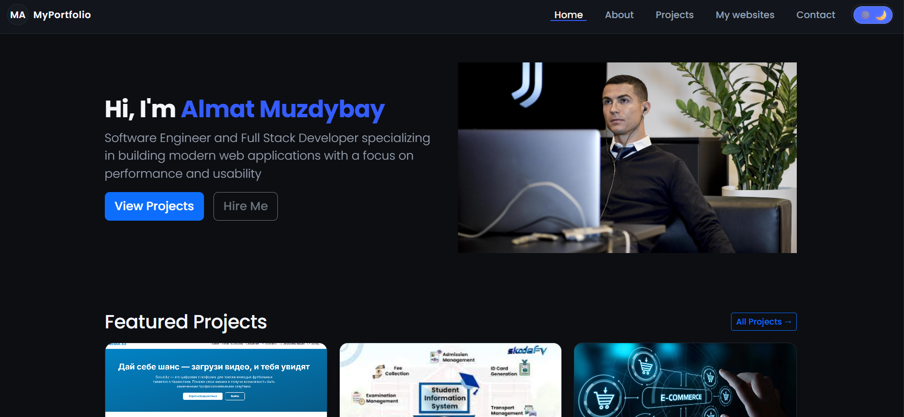
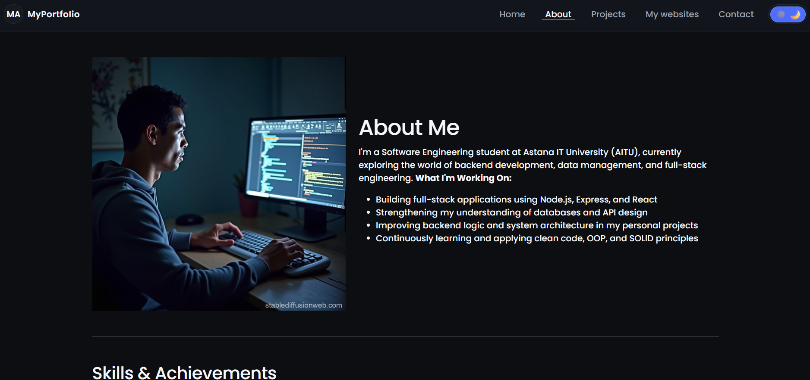
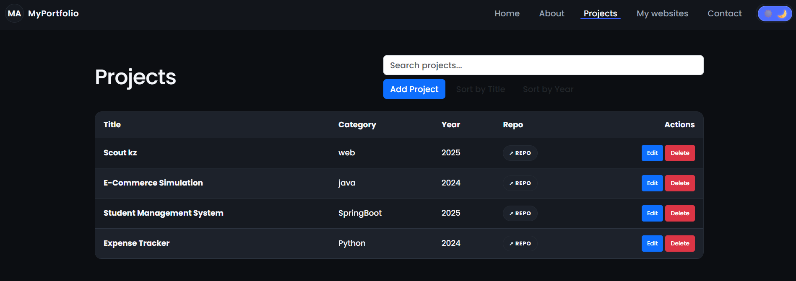
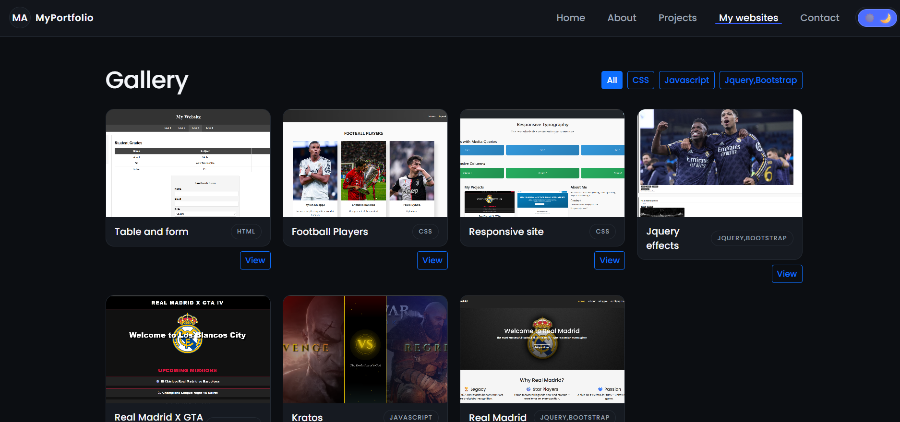
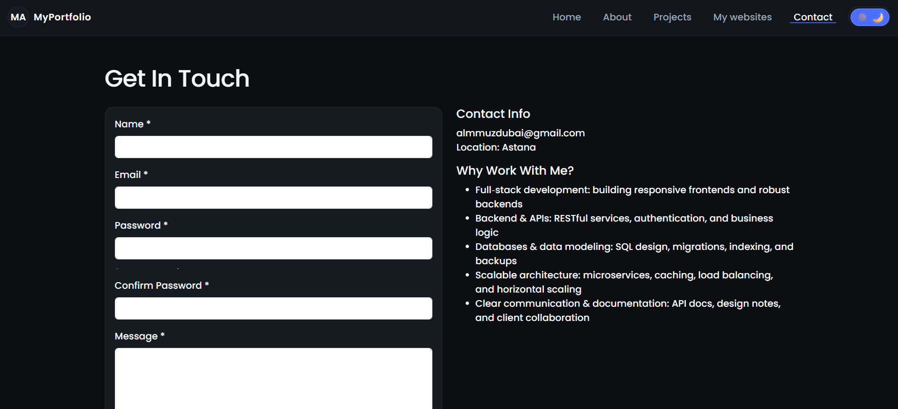

# Personal Portfolio Website

## Overview

An individually developed responsive portfolio website showcasing my skills, projects, gallery, and contact information. The project fulfills all mandatory requirements (HTML, CSS, JavaScript/jQuery, responsiveness, CRUD, filtering/lightbox, form validation) plus optional dark/light theme persistence. It is deployed on GitHub Pages / Netlify.

Live URL: **https://almatmz.github.io/Portfolio-Website/**  
Netlify URL:**https://portfolioalmat.netlify.app/**

---

## Pages

| Page     | Purpose                             | Key Elements                                             |
| -------- | ----------------------------------- | -------------------------------------------------------- |
| Home     | Intro hero + featured projects      | Hero section (Grid), CTA buttons, modal trigger          |
| About    | Biography & Skills                  | Responsive image, skills/achievements table              |
| Projects | Dynamic CRUD management             | Search, sort, add/edit/delete (modals), animations       |
| My websites  | Filterable image gallery + lightbox | Category filters, fade transitions, prev/next navigation |
| Contact  | User communication                  | Validated form, password strength meter                  |











All pages share a common `<header>`, `<nav>`, `<footer>` and responsive layout.

---

## Folder Structure

```
/
├─ index.html
├─ about.html
├─ projects.html
├─ gallery.html
├─ contact.html
├─ css/
│  └─ style.css
│  └─ responsive-nav.css
├─ js/
│  ├─ main.js        (theme toggle, navigation, shared modal/form logic)
│  ├─ crud.js        (projects CRUD table)
│  ├─ gallery.js     (gallery filtering + lightbox)
│  └─ form.js        (contact form validation & password strength)
│  └─ responsive-nav.js
├─ images/           (project + gallery images)
├─ data/             (JSON gallery load implemented)
└─ README.md
```

---

### 1. General

- 5+ logical pages; consistent navigation.
- Each page uses `<header>`, `<main>`, `<footer>`.
- Navigation bar visible everywhere (desktop + mobile hamburger).
- Logo + Flexbox layout in header; social links & copyright in footer.

### 2. HTML

- Semantic tags: header, nav, main, section, footer, table, form, ul/li.
- At least one table: Skills table (About) & Projects CRUD table.
- At least one form: Contact form (includes password strength & confirmation).
- Proper usage of headings hierarchy (`h1`–`h2`–`h3` where appropriate).
- Images with `alt` text; below-the-fold images use `loading="lazy"`.

### 3. CSS

- Single external stylesheet `css/style.css`; no inline/internal styles.
- Consistent selectors, spacing, colors, fonts, alignment.
- Flexbox (header/nav, cards, responsive panels) + Grid (hero, gallery, project cards).
- Positioning: Sticky header, absolute close button in lightbox, backdrop overlay.
- Pseudo-classes: `:hover`, `:focus-visible`, `:nth-of-type(even)` for zebra rows.
- Variables defined in `:root` (colors, spacing, typography, transitions).
- Google Font: Poppins.
- Responsive units (`clamp`, `vw`, media queries).

### 4. Responsive Design

- Media queries at 992px, 700px, 480px breakpoints.
- Hamburger menu replaces horizontal nav on small screens.
- Grids collapse to single-column; images scale; tables scroll horizontally.
- Font sizes & spacings adapt using `clamp()` + breakpoints.

### 5. JavaScript & jQuery

#### 5.1 Form Validation (Contact Form)

- Required field checks: name, email, password, confirm password, message.
- Email RegEx validation.
- Password strength meter (length, uppercase, number, symbol, extended length).
- Password confirmation match.
- Real-time feedback (`is-valid` / `is-invalid`, alert messages).
- Submission blocked until all criteria met.

#### 5.2 Dynamic Search

- Real-time search input on Projects page filters items case-insensitively while typing (`input` event).

#### 5.3 Modal / Popup Interaction

- Bootstrap modals for: Project Details, Add Project, Edit Project, Lightbox.
- Programmatic opening/closing with Bootstrap JS methods.
- Inline form submission inside modals (Add/Edit Project & Interest form).

#### 5.4 Dynamic Table (Projects CRUD)

- Display list of project objects from an array.
- Create: Add project via modal.
- Read: Render dynamic rows.
- Update: Edit modal pre-fills project values.
- Delete: Confirmation prompt + fadeOut animation before re-render.
- Search: Immediate filtering of table rows.
- Sort: Title and Year ascending/descending toggle.
- Animations: Fade/translate for rows on render & deletion.

#### 5.5 Image Gallery (Filtering + Lightbox)

- Gallery grid (CSS Grid + Bootstrap utilities).
- Category filter buttons (All/Web/Design/Branding) using jQuery filtering logic.
- Lightbox modal: enlarge image, prev/next navigation, fade transitions.
- Smooth `.fadeIn()`, `.fadeOut()`, `.animate()` used.
- Bonus: Items loaded from a JS array (can switch to external JSON file easily).

#### 5.6 Animation & Visual Feedback

Implemented at least three:

1. Card hover elevation (transform + shadow).
2. Table and gallery item fade/translate entrance.
3. Lightbox cross-fade between images.
4. Hamburger menu slide transitions.
5. Theme toggle icon fade/scale.

#### 5.7 Optional Features

- Dark/Light Theme Toggle with preference in `localStorage`.

### 6. Creativity & Presentation

- Consistent minimal dark theme; accessible contrast.
- Fluid typography with `clamp()`.
- Clear UX (logical navigation labels, consistent buttons, responsive modals).
- Semantic alt texts and ARIA attributes (e.g., `aria-expanded` on nav toggle).

---

## Key Files Explanation

| File                      | Role                                                                       |
| ------------------------- | -------------------------------------------------------------------------- |
| `css/style.css`           | Global styles, tokens, layout (Flex/Grid), responsive rules, theme palette |
| `js/main.js`              | Theme toggle, nav toggle/hamburger, year injection, shared modals          |
| `js/crud.js`              | Projects CRUD logic (add/edit/delete/search/sort) + animations             |
| `js/gallery.js`           | Gallery rendering, category filtering, lightbox image transitions          |
| `js/form.js`              | Contact form validation + password strength meter                          |
| `data/gallery-items.json` | External JSON data source                        |
